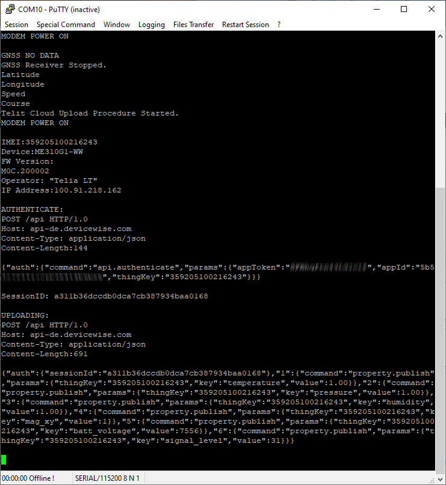
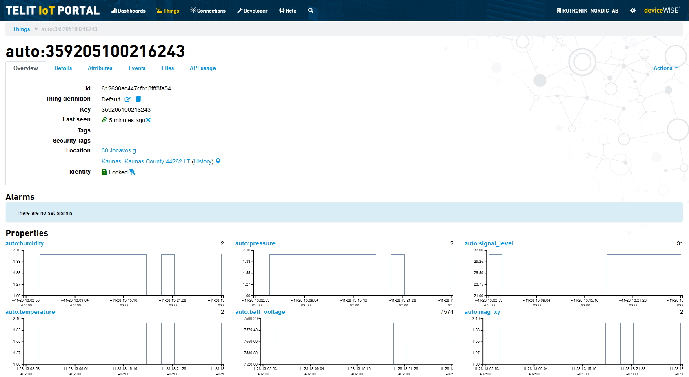
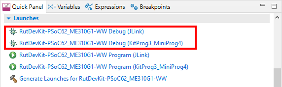

# RutDevKit-PSoC62 ME310G1-WW Example

Rutronik Development Kit Programmable System-on-Chip CY8C6245AZI-S3D72 "RutDevKit-PSoC62_ME310G1-WW" Code Example. 

This code example is for the Telit's LPWA modem ME310G1-WW and Telit's [portal-dev.telit](https://portal-dev.telit.com/app/login) cloud demonstration. The unreleased Arduino shield's prototype [RUT_xE310](https://github.com/RutronikKaunas/RUT_xE310_Shield) has been used for creating this code example.

 

## Requirements

- [ModusToolbox® software](https://www.infineon.com/cms/en/design-support/tools/sdk/modustoolbox-software/) v2.4

  

### Using the code example with a ModusToolbox IDE:

1. Import the project: **File** > **Import...** > **General** > **Existing Projects into Workspace** > **Next**.
2. Select the directory where **"RutDevKit-PSoC62_ME310G1-WW"** resides and click  **Finish**.
3. Update libraries using  a **"Library Manager"** tool.
4. Select and build the project **Project ** > **Build Project**.

### Operation

The firmware example uses KitProg3 Debug UART for debug output. The LED1 is blinking then the demo is in idle state or shines constantly if it is trying to upload data to the cloud. 

The simulated data is wrapped into a JSON's format objects and posted to the cloud using HTTP protocol. This is a most basic example that works well if high energy consumption and relatively high data transfers are not an issue.

To access the [portal-dev.telit](https://portal-dev.telit.com/app/login) with the devkit the Application ID and Token needs to be provided in modem.c file

```
/*App ID and tokens*/
#warning "Please define a telit cloud application ID and application Token here"
const char telit_appID[] = "xxx";
const char telit_appToken[] = "yyy";
```






### Debugging

If you successfully have imported the example, the debug configurations are already prepared to use with a the KitProg3, MiniProg4, or J-link. Open the ModusToolbox perspective and find the Quick Panel. Click on the desired debug launch configuration and wait for the programming completes and debug process starts.



## Legal Disclaimer

The evaluation board including the software is for testing purposes only and, because it has limited functions and limited resilience, is not suitable for permanent use under real conditions. If the evaluation board is nevertheless used under real conditions, this is done at one’s responsibility; any liability of Rutronik is insofar excluded. 


